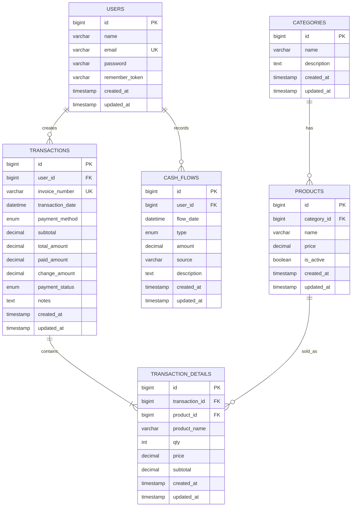

# ERD Aplikasi Kasir Booth

ERD ini disusun dari ringkasan pada `kasir_booth_summary.pdf` dengan fokus fitur:

- transaksi penjualan
- pembayaran `cash` dan `qris`
- manajemen produk dan kategori
- laporan harian
- kas masuk dan kas keluar

## Entitas Utama

### 1. `users`
Menyimpan akun pengguna aplikasi, minimal untuk kasir/admin yang mencatat transaksi dan arus kas.

| Kolom | Tipe | Keterangan |
| --- | --- | --- |
| id | bigint | Primary key |
| name | varchar | Nama pengguna |
| email | varchar | Email login, unique |
| password | varchar | Password hash |
| remember_token | varchar nullable | Token login Laravel |
| created_at | timestamp | Timestamp Laravel |
| updated_at | timestamp | Timestamp Laravel |

### 2. `categories`
Mengelompokkan produk, misalnya minuman, makanan, snack.

| Kolom | Tipe | Keterangan |
| --- | --- | --- |
| id | bigint | Primary key |
| name | varchar | Nama kategori |
| description | text nullable | Deskripsi kategori |
| created_at | timestamp | Timestamp Laravel |
| updated_at | timestamp | Timestamp Laravel |

### 3. `products`
Data produk yang dijual di booth.

| Kolom | Tipe | Keterangan |
| --- | --- | --- |
| id | bigint | Primary key |
| category_id | bigint | FK ke `categories.id` |
| name | varchar | Nama produk |
| price | decimal(12,2) | Harga jual |
| is_active | boolean | Status produk aktif/nonaktif |
| created_at | timestamp | Timestamp Laravel |
| updated_at | timestamp | Timestamp Laravel |

### 4. `transactions`
Header transaksi penjualan.

| Kolom | Tipe | Keterangan |
| --- | --- | --- |
| id | bigint | Primary key |
| user_id | bigint | FK ke `users.id`, kasir yang memproses |
| invoice_number | varchar | Nomor transaksi, unique |
| transaction_date | datetime | Waktu transaksi |
| payment_method | enum | `cash` / `qris` |
| subtotal | decimal(12,2) | Total sebelum penyesuaian |
| total_amount | decimal(12,2) | Total akhir transaksi |
| paid_amount | decimal(12,2) nullable | Nominal dibayar pelanggan |
| change_amount | decimal(12,2) nullable | Kembalian, terutama untuk cash |
| payment_status | enum | `paid`, `pending`, `confirmed` |
| notes | text nullable | Catatan transaksi |
| created_at | timestamp | Timestamp Laravel |
| updated_at | timestamp | Timestamp Laravel |

### 5. `transaction_details`
Detail item per transaksi.

| Kolom | Tipe | Keterangan |
| --- | --- | --- |
| id | bigint | Primary key |
| transaction_id | bigint | FK ke `transactions.id` |
| product_id | bigint | FK ke `products.id` |
| product_name | varchar | Snapshot nama produk saat transaksi |
| qty | integer | Jumlah item |
| price | decimal(12,2) | Harga per item saat transaksi |
| subtotal | decimal(12,2) | `qty x price` |
| created_at | timestamp | Timestamp Laravel |
| updated_at | timestamp | Timestamp Laravel |

### 6. `cash_flows`
Pencatatan kas masuk dan kas keluar di luar transaksi penjualan utama, atau sebagai jurnal kas operasional.

| Kolom | Tipe | Keterangan |
| --- | --- | --- |
| id | bigint | Primary key |
| user_id | bigint | FK ke `users.id`, pencatat |
| flow_date | datetime | Waktu pencatatan |
| type | enum | `in` / `out` |
| amount | decimal(12,2) | Nilai kas |
| source | varchar nullable | Sumber/tujuan kas |
| description | text nullable | Keterangan |
| created_at | timestamp | Timestamp Laravel |
| updated_at | timestamp | Timestamp Laravel |

## Diagram ERD

## Catatan Desain

- `transaction_details.product_name` disimpan sebagai snapshot agar histori transaksi tetap aman walaupun nama produk berubah.
- `payment_status` berguna untuk alur QRIS manual, karena kasir perlu konfirmasi pembayaran.
- laporan harian tidak harus memiliki tabel sendiri karena bisa diambil dari agregasi `transactions` dan `cash_flows`.
- bila nanti aplikasi butuh stok, bisa ditambah kolom `stock` pada `products` atau dibuat tabel mutasi stok terpisah.
